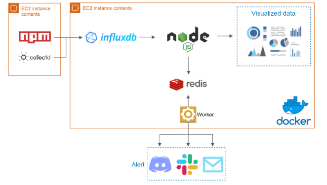
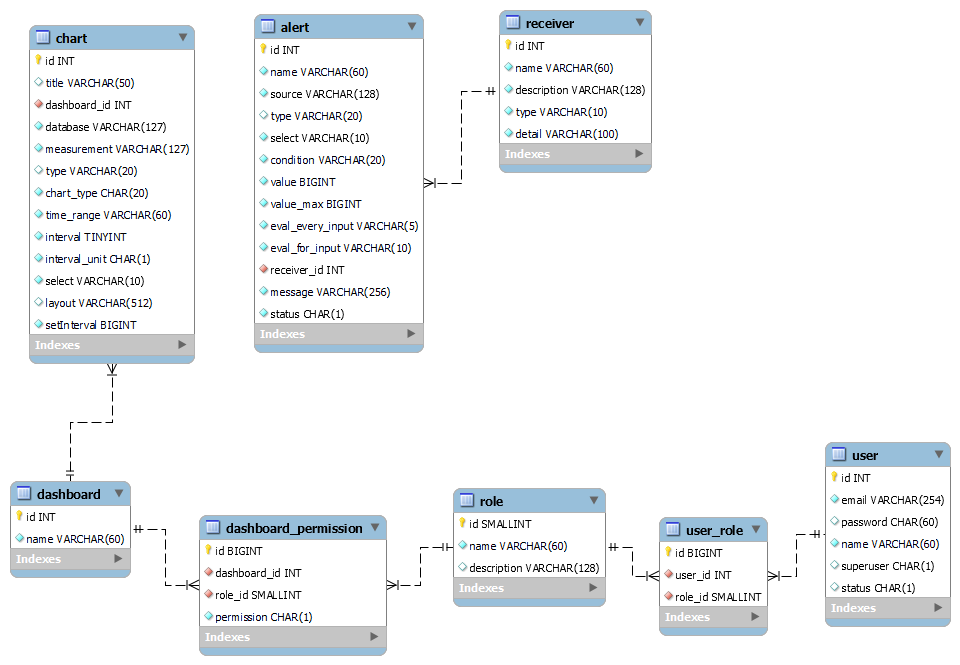

#  The Eye of Horus

### A Monitoring and Alerting Application

- Collect system metrics periodically by utilizing collectd.
- Store time-series data by Influxdb.
- Visualize data in bar/line chart and construct dashboard with Plotly.
- Send alert while comparing metric values to a user-defined threshold by Linux crontab to execute workers periodically.
- Allow users to define alert rules and send customized alert messages via email, discord, and slack.

<br>

## **Table of Contents**

- [Architecture](#Architecture)
- [Tech Stack](#Tech-Stack)
- [Database Schema](#Database-Schema)
- [Demo](#Demo)
- [Getting Started](#Getting-Started)
  - [Install from a source](#Install-from-a-source)
  - [Install The-Eye-of-Horus with Docker](#Install-The-Eye-of-Horus-with-Docker)
- [Contact](#Contact)

<br>

## **Architecture**

<p align="center">
  
</p>

<br>
 
## **Tech Stack**

- ### **Back-End**

  - Node.js
  - Express.js

- ### **Front-End**

  - HTML
  - CSS
  - JavaScript + AJAX + jQuery

- ### **Database**

  - MySQL
  - Redis
  - InfluxDB (TSDB)

- ### **AWS Cloud Services**

  - Elastic Compute Cloud (EC2)

- ### **Networking**
  - HTTP & HTTPS
  - NGINX
  - SSL Certificate
  - Domain Name System (DNS)

<br>

## **Database Schema**

<p align="center">
  
</p>

<br>

## **Demo**

### **Login page & Dashboard detail**
Users can check charts in the dashboard by entry each dashboard. Charts immediately update without refresh website. The period of charts' update is according to interval setting.


### **Add dashboard**
Create/set dashboard with different permission.


### **Create chart**
Users can create charts with different source and customized the title, time range, chart style, interval, select and x(y)-Axis title.


### **Add receiver**
Create specific receivers. Receiver type can be email, discord, or slack.


### **Add alert**
Users can define alert rules and send customized alert messages via email, discord, and slack.


<br>

# Getting Started

## **Install from a source**

### **Prerequisites**

Listed below are the softwares you need to install.

- [MySQL v8](https://dev.mysql.com/downloads/installer/)
- [Redis v6.2](https://redis.io/docs/getting-started/)
- [Influxdb v1.8.10](https://portal.influxdata.com/downloads/)

### **Installing**

1. Clone the repo

```
  https://github.com/CHLin13/The-Eye-of-Horus.git
```

2. Go to the target folder

```
  cd The-Eye-of-Horus
```

3. Install NPM packages

```
  npm install
```

4. Edit .env file

5. Run the project

```
  npm run start
```

6. Run the alert-worker

```
  npm run worker
```

7. (Optional) Use [npm package](https://www.npmjs.com/package/@chlin13/the-eye-of-horus) to collect application performance data

```
npm i @chlin13/the-eye-of-horus
```

<br>  
<br>

## **Install The-Eye-of-Horus with Docker**

### **Prerequisites**


- [Install Docker](https://docs.docker.com/engine/install/)
- [Install Docker Compose](https://docs.docker.com/compose/install/)
- [Install crontab](https://tecadmin.net/install-crontab-in-linux/)
- Create nginx.conf [example](https://www.nginx.com/resources/wiki/start/topics/examples/full/)

* collectd setting 

1. Install collectd (Red Hat Linux) [other OS](https://collectd.org/download.shtml)

```
yum install collectd
```

2. Open `collectd.conf` with default editor

```
vi /etc/collectd.conf
```

3. Add lines to `collectd.conf` according to [collectd.conf](./docs/collectd.conf)

4. Restart collectd
```
sudo systemctl restart collectd
```


### **Installing**

Here is the [docker-compose.yml](./docs/docker-compose.yml) that powers the whole setup.
1. Create .env file and write the content follow by [.env.example](./docs/docker.env)
2. Update your `.env` file, `influxdb port` and `nginx folder path` in docker-compose.yml
3. Run all containers with docker-compose up
```
docker-compose up -d
```
4. Run a new command in influx container

```
docker exec -it the-eye-of-horus-influx-1 /bin/bash
```

4. Open `influxdb.conf` with default editor
```
vi /etc/influxdb/influxdb.conf
```

5. Add lines to `influxdb.conf` according to [influxdb.conf.example](./docs/influxdb.conf)

6. Docker pull [worker](https://hub.docker.com/r/chlin13/eye-worker)
```
docker pull chlin13/eye-worker
```

7. Create `worker .env file` content refer to [worker.env.example](./docs/worker.env)


8. Add new job in crontab

```
crontab -e
```

10. Crontab setting example

```
* * * * * docker run --name ___worker_name___ --env-file ___worker_.env_file_path___ --rm eye-worker >> ___log_file_path___ 2>&1
```

11. (Optional) Use [npm package](https://www.npmjs.com/package/@chlin13/the-eye-of-horus) to collect application performance data

```
npm i @chlin13/the-eye-of-horus
```

## **Contact**

- **Author:** <a href="https://github.com/CHLin13" target="_blank">CH Lin</a>
- **Email:** lch132502@gmail.com
